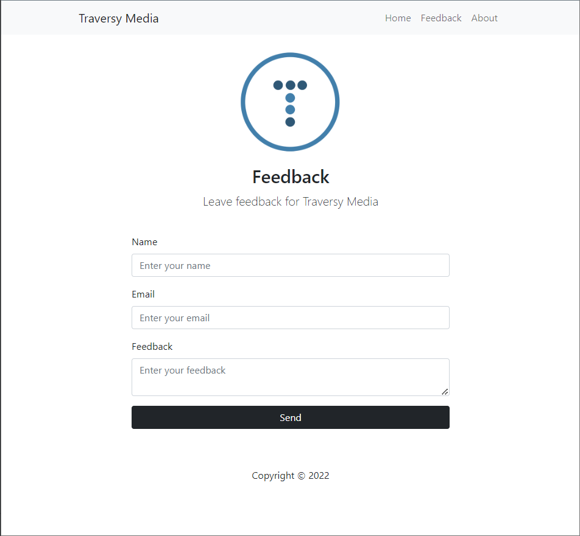

# FeedBack App
### App Description
This app allows the user to send a feedback to the developer. With PHP, the feedback is stored in a database and can be viewed in the feedback page.
PHP allows validation of the input fields and the user can only submit the form if all the fields are filled.

### App Walk-though
 

## Technologies used
- HTML
- CSS
- PHP
- MySQL
- Bootstrap
- XAMPP
- phpMyAdmin

## Credits
This app was created following the <strong>[tutorial](https://www.youtube.com/watch?v=BUCiSSyIGGU&ab_channel=TraversyMedia)</strong> from <strong>[Brad Traversy](https://www.youtube.com/@TraversyMedia)</strong> on YouTube.